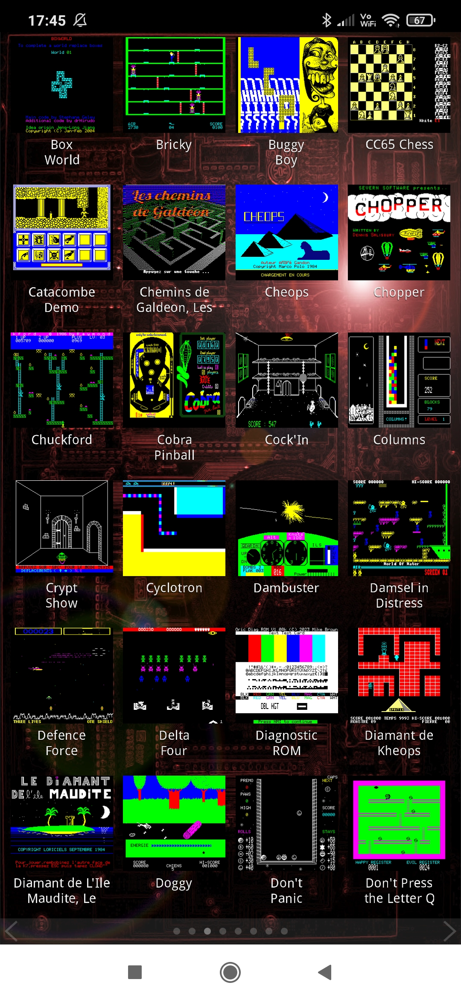
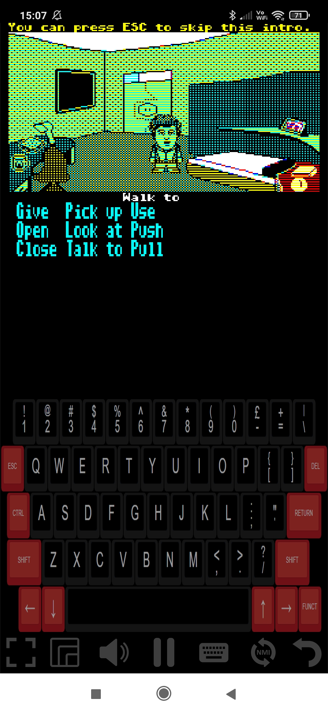

# JORIC
**JOric** is an Oric emulator written in Java, using the libGDX cross-platform development framework, targeting primarily HTML5 and the web:

https://oric.games

The UI of JOric has been designed primarily with mobile devices in mind, so give it a try on your Android phone! 

## Features
- Intuitive, familiar, mobile-like UI, with game selection screens. Swipe or click to the right:
  
           | 
:-------------------------:|:-------------------------:

- Support for direct URL path access to individual games:
  - e.g. [https://oric.games/#/stormlord](https://oric.games/#/stormlord)
- Support for loading games via a ?url= request parameter:
  - e.g. [https://oric.games/?url=https://defence-force.org/files/im10.tap](https://oric.games/?url=https://defence-force.org/files/im10.tap)
  - e.g. [https://oric.games/?url=https://cdn.oric.org/games/software/z/zipnzap/ZIPNZAP.DSK](https://oric.games/?url=https://cdn.oric.org/games/software/z/zipnzap/ZIPNZAP.DSK)
- Support for games contained within ZIP files:
  - e.g. [https://oric.games/?url=https://defence-force.org/files/space1999-en.zip](https://oric.games/?url=https://defence-force.org/files/space1999-en.zip)
- Support for loading games attached to forum posts:
  - e.g. [https://oric.games/?url=https://forum.defence-force.org/download/file.php?id=4084](https://oric.games/?url=https://forum.defence-force.org/download/file.php?id=4084)
- Being a PWA (Progressive Web App), it can be installed locally to your device!
- And it also comes as a standalone Java app, for those who prefer Java.

## How to run games from the Home screen
JOric's game selection screens contain a list of over 100 games and demos. These games are not packaged with JOric but rather JOric loads the games from well known Oric websites, such as oric.org and defence-force.org.

Start by going to https://oric.games. This will load the JOric title or home screen. There is a small question mark icon in the top right that pops up a dialog with a brief description and the current version. It mentions that in order to start playing games, simply swipe or click to the right.

           |      | 
:-------------------------:|:-------------------------:|:-------------------------:

The screen works in a very similar way to the user interface of a mobile device. If you are accessing the website on a touch screen device, then you can swipe to the right to get to the next page. If you are on desktop, you can use the right arrow key, or drag/fling with your mouse, or click on the small right arrow at the bottom of the screen. Note that it has pagination indicator dots at the bottom of the screen that show how many pages there are, and which of those pages you are currently on.

           |      |
:-------------------------:|:-------------------------:|:-------------------------:

Keyboard navigation within the game selection screens is also possible as follows:

* Left/Right/Up/Down: Navigates by one game in the corresponding direction.
* Home: Goes back to the JORIC title page.
* PgDn: Goes one page of games to the right.
* PgUp: Goes one page of games to the left.
* End: Goes to the last page of games.
* Enter/Space: Runs the selected game, as indicated by the white selection box.
* A-Z: Jumps to the page of games that start with the letter.

## The Machine screen
When a game is run, the machine screen is displayed. It shows the Oric screen and various icons, which may be either at the bottom of the screen (for portrait) or to the sides (for landscape).

The following two screen shots show the icons when running in Chrome on a Windows machine:

           | 
:-------------------------:|:-------------------------:

And the three below show the placement of the icons when running in Portrait mode as an installed PWA (Progressive Web App) on an Android phone:

           |      | 
:-------------------------:|:-------------------------:|:-------------------------:

The function of these icons is as follows:

Icons                                 | Description 
:------------------------------------:|:------------------------------------:
       |Toggles full screen mode.
       |Turns on sound.
         |Turns off sound.
             |Pauses the emulator.
              |Resumes emulation.
     |Toggles display of the keyboard.
               |Triggers an NMI interrupt.
        |Goes back to the JOric home screen.

It is important to note that if you have accessed JOric directly via a game URL (either one of the /#/ paths, or by using the ?url= request parameter), then the speaker icon will initially be muted. This is because web browsers do not allow sound to be played automatically without a user interaction. In this scenario, you will need to click the speaker icon to turn sound on.

If instead you have started a game by clicking on the game's thumbnail image from JOric's game list screen, then sound will be unmuted automatically.

## Installing the web app on your device.
JOric follows the PWA (Progressive Web App) spec and can therefore be installed on your device. When you go to the https://oric.games web site, and you haven't previously installed JOric, then the browser may promote it to you for installation. In Chrome, one of the ways it does this is to show a little installation icon at the end of the browser location field. Clicking on that icon will install JOric as if it is a standalone app on your device.

On Windows, this means that you'll see JOric in your Windows menu, and it can be pinned to your task bar, if you choose to do that. On a mobile device, such as an Android phone, it will install it alongside all the other apps on your phone and can then be launched like any other standalone app on your phone. Internally, it still runs the web version though from the website, so is automatically kept up to date with new releases.

## Installing the Java verson
JOric is a cross platform application. The release build creates both the web version, which is deployed to https://oric.games, and also a Java version that is available under the Releases page of the github project:

https://github.com/lanceewing/joric/releases/latest

The .jar file is an executable jar. If you have the Java virtual machine installed on your computer, then running the downloaded JOric jar is as easy as double clicking the .jar file.

Java runs on many platforms, including Windows, Mac, and Linux, and so this is another way to run JOric on your device. On Windows, for example, you could choose to install the web version (as described earlier), or you could download and run the Java version. If JOric does not start up when you double click the jar, then it most likely means that you do not have Java installed.

Not everyone is a fan of Java desktop apps, due to the overhead of downloading and installing the Java virtual machine, so if you do not already have Java installed, then I would recommend using the web version, as the web version should work on any modern web browser.

## Credits and Acknowledgements
This project would not have been possible without the following projects and their authors:

- [libgdx](https://libgdx.com/): The cross-platform game development framework.
- [gdx-liftoff](https://github.com/libgdx/gdx-liftoff): Written by Tommy Ettinger. Used to generate the initial libgdx project boilerplate.
- [gwt-webworker](https://gitlab.com/ManfredTremmel/gwt-webworker): Written by Manfred Trammel. The key to running libgdx gwt code in a web worker.
- [gwt-jszip](https://github.com/ainslec/GWTJSZip): Originally written by Aki Miyazaki, extended by Chris Ainsley.
- [jszip](https://github.com/Stuk/jszip): Written by Stuart Knightley. Used by JORIC to unzip imported games.
- [GWT](https://www.gwtproject.org): Google Web Toolkit, used by libgdx to transpile the JORIC Java code to JavaScript.
- [ringbuf.js](https://github.com/padenot/ringbuf.js/blob/main/js/ringbuf.js): Written by Paul Adenot. Used for the keyboard matrix, audio queue and pixel array in JORIC.
- [dialog.js](https://css-tricks.com/replace-javascript-dialogs-html-dialog-element/): Written by Mads Stoumann. Used for most of the dialogs.

In addition to the above, I would also like to acknowledge the community of [https://forum.defence-force.org/](https://forum.defence-force.org/) for their testing efforts, encouragement and helpful suggestions for improvement.

