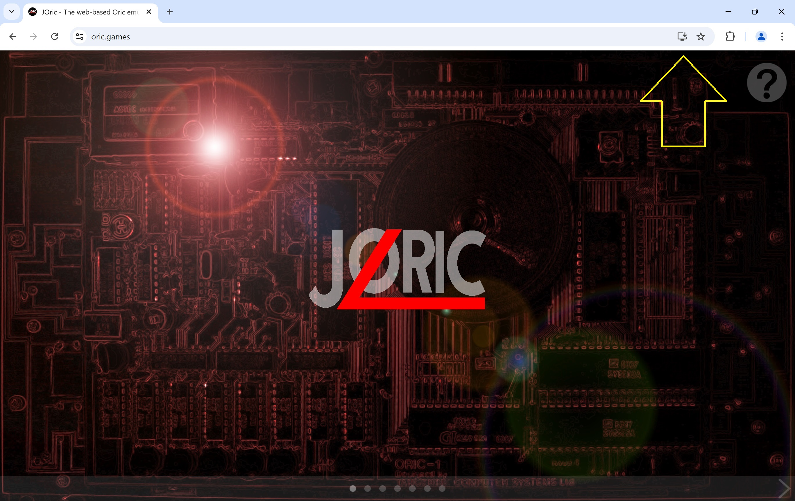
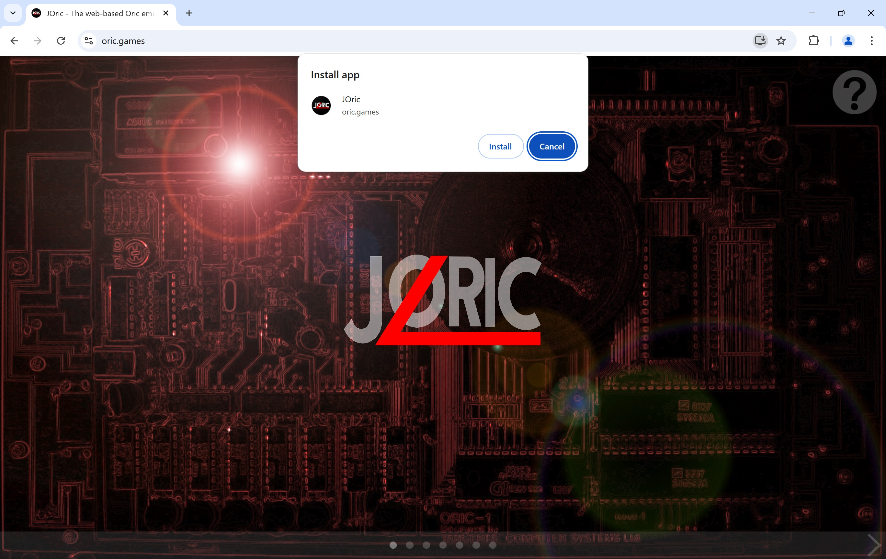

# JORIC
**JOric** is an Oric emulator written in Java, using the libGDX cross-platform development framework, targeting primarily HTML5 and the web. Being such, it can run directly in your web browser:

https://oric.games

The UI of JOric has been designed primarily with mobile devices in mind, so give it a try on your Android phone! 

## Features
- Intuitive, familiar, mobile-like UI, with game selection screens. Swipe or click to the right:
  
           | 
:-------------------------:|:-------------------------:

- Support for direct URL path access to individual games:
  - e.g. [https://oric.games/#/stormlord](https://oric.games/#/stormlord)
  - Or into BASIC: [https://oric.games/#/basic](https://oric.games/#/basic)
- Support for loading games via a ?url= request parameter:
  - e.g. [https://oric.games/?url=https://defence-force.org/files/im10.tap](https://oric.games/?url=https://defence-force.org/files/im10.tap)
  - e.g. [https://oric.games/?url=https://cdn.oric.org/games/software/z/zipnzap/ZIPNZAP.DSK](https://oric.games/?url=https://cdn.oric.org/games/software/z/zipnzap/ZIPNZAP.DSK)
- Support for games contained within ZIP files:
  - e.g. [https://oric.games/?url=https://defence-force.org/files/space1999-en.zip](https://oric.games/?url=https://defence-force.org/files/space1999-en.zip)
- Support for loading games attached to forum posts:
  - e.g. [https://oric.games/?url=https://forum.defence-force.org/download/file.php?id=4084](https://oric.games/?url=https://forum.defence-force.org/download/file.php?id=4084)
- Being a PWA (Progressive Web App), it can be installed locally to your device!
- And it also comes as a standalone Java app, for those who prefer Java.

## How to run games from the Home screen
JOric's game selection screens contain a list of over 150 games and demos. These games are not packaged with JOric but rather JOric loads the games from well known Oric websites, such as oric.org and defence-force.org.

Start by going to https://oric.games. This will load the JOric title or home screen. There is a small question mark icon in the top right that pops up a dialog with a brief description and the current version. It mentions that in order to start playing games, simply swipe or click to the right.

           |      | 
:-------------------------:|:-------------------------:|:-------------------------:

The screen works in a very similar way to the user interface of a mobile device. If you are accessing the website on a touch screen device, then you can swipe to the right to get to the next page. If you are on desktop, you can use the right arrow key, or drag/fling with your mouse, or click on the small right arrow at the bottom of the screen. Note that it has pagination indicator dots at the bottom of the screen that show how many pages there are, and which of those pages you are currently on.

           |      |
:-------------------------:|:-------------------------:|:-------------------------:

Keyboard navigation within the game selection screens is also possible as follows:

* Left/Right/Up/Down: Navigates by one game in the corresponding direction.
* Home: Goes back to the JORIC title page.
* PgDn: Goes one page of games to the right.
* PgUp: Goes one page of games to the left.
* End: Goes to the last page of games.
* Enter/Space: Runs the selected game, as indicated by the white selection box.
* A-Z: Jumps to the page of games that start with the letter.

### Open File Icon
The JOric title screen also has an Open File icon in the bottom right corner. If you click on this icon, an open file dialog will be shown. You can then select a .tap file, .dsk file, or a .zip file containing either a .tap or .dsk file, for the emulator to run. This can be used for programs that are not available in the game selection pages, such as games that are still being developed, or that are currently for purchase through services such as itch.io and Steam. 

### Drag and Drop
As an alternative to using the Open File icon, you can instead simply drag and drop an Oric program onto the JOric home screen. This will work for any Oric .tap, .dsk or .zip file containing a .dsk. or .tap. The dropped program will be immediately run by the emulator.
  
## The Machine screen
When a game is run, the machine screen is displayed. It shows the Oric screen and various icons, which may be either at the bottom of the screen (for portrait) or to the sides (for landscape).

The following two screen shots show the icons when running in Chrome on a Windows machine:

           | 
:-------------------------:|:-------------------------:

And the three below show the placement of the icons when running in Portrait mode as an installed PWA (Progressive Web App) on an Android phone:

           |      | 
:-------------------------:|:-------------------------:|:-------------------------:

The function of these icons is as follows:

Icons                                 | Description                          |Icons                                 | Description                          
:------------------------------------:|:------------------------------------:|:------------------------------------:|:------------------------------------:
       |Toggles full screen mode.             |     |Toggles display of the keyboard.
       |Turns on sound.                       |         |Turns off sound.
             |Pauses the emulator.                  |              |Resumes emulation.
               |Triggers an NMI interrupt.            |        |Goes back to the JOric home screen.

It is important to note that if you have accessed JOric directly via a game URL (either one of the /#/ paths, or by using the ?url= request parameter), then the speaker icon will initially be muted. This is because web browsers do not allow sound to be played automatically without a user interaction. In this scenario, you will need to click the speaker icon to turn sound on.

If instead you have started a game by clicking on the game's thumbnail image from JOric's game list screen, then sound will be unmuted automatically.

## Installing the web app on your device.
JOric follows the PWA (Progressive Web App) spec and can therefore be installed on your device. When you go to the https://oric.games web site, and you haven't previously installed JOric, then the browser may promote it to you for installation. In Chrome, one of the ways it does this is to show a little installation icon at the end of the browser location field, as indicated by the yellow arrow in the screenshot below. Clicking on that icon will install JOric as if it were a standalone app on your device.

           | 
:-------------------------:|:-------------------------:

On Windows, this means that you'll see JOric in your Windows menu, and it can be pinned to your task bar, if you choose to do that. On a mobile device, such as an Android phone, it will install it alongside all the other apps on your phone and can then be launched like any other standalone app on your phone. Internally, it still runs the web version though from the website, so is automatically kept up to date with new releases.

## Installing the Java verson
JOric is a cross platform application. The release build creates both the web version, which is deployed to https://oric.games, and also a Java version that is available under the Releases page of the github project:

https://github.com/lanceewing/joric/releases/latest

The .jar file is an executable jar. If you have the Java virtual machine installed on your computer, then running the downloaded JOric jar is as easy as double clicking the .jar file.

Java runs on many platforms, including Windows, Mac, and Linux, and so this is another way to run JOric on your device. On Windows, for example, you could choose to install the web version (as described earlier), or you could download and run the Java version. If JOric does not start up when you double click the jar, then it most likely means that you do not have Java installed.

Not everyone is a fan of Java desktop apps, due to the overhead of downloading and installing the Java virtual machine, so if you do not already have Java installed, then I would recommend using the web version, as the web version should work on any modern web browser.

## Installing the Android APK
JOric's build process also creates a native Android APK file. This can be found as a separate asset available under the Releases page:

https://github.com/lanceewing/joric/releases/latest

The .apk file has been signed, but there are no plans to make this available in the Google Play Store. It is provided for those who might like a native Android build as an alternative to installing the web PWA. Simply download the .apk file from the Releases page and your phone should prompt you asking if you'd like to install it. Not being from the Google Play Store though, you'll get some warnings about it coming from an unknown source.

Personally, I prefer to install the web version to my Android phone, as a PWA app (see section above), as its more convenient and updates automatically. You may find that the sound performs better in the native APK version though.

## Running on your own local web server
As the web version of JOric is a essentially static content, you could, if you like, download the release ZIP, extract it, and run it by serving it from your own web server, rather than the oric.games web site. There are a couple of gotchas with this though: JOric uses some browser APIs that are not enabled by default. For example, it uses SharedArrayBuffer for multiple things (keyboard events, graphics, sound), as it is a very quick way to share data between the web worker that runs the emulation, the audio thread, and the main browser UI thread. In order to enable this API, the web server must set the following two HTTP response headers in every response:

```
Cross-Origin-Opener-Policy: same-origin
Cross-Origin-Embedder-Policy: require-corp
```

(For more details, see here: https://developer.mozilla.org/en-US/docs/Web/API/Window/crossOriginIsolated)

To make this as easy as possible for you, the JOric ZIP file for the web version comes with some .swshtaccess files in three of the folders that are designed to be read by the "Simple Web Server" web server. They are like .htaccess files that you may already be familiar with but for the Simple Web Server instead (SWS). 

1. Download the release ZIP of joric, e.g.: https://github.com/lanceewing/joric/releases/download/v1.0.15/joric-web-v1.0.15.zip
2. Extract the joric ZIP into a folder.
3. Download Simple Web Server for your platform from here: https://simplewebserver.org/download.html
4. Start up Simple Web Server
5. Click "New Server" button in bottom right corner
6. For the folder path, choose the folder that contains the index.html file from the extracted joric ZIP
7. Choose your port number. It works with port 80, so that is what I use, but could be anything, e.g. 8080, 8081, etc.
8. Expand the "Advanced Rules" section and tick the "Enable .swshtaccess configuration files" checkbox.
9. Click the "Create Server" button in the bottom right. This will start up the web server..
10. Now go to the web browser and access localhost on the port you chose. It should load the JOric home screen. Scroll to the right to choose a game.

It is the .swshtaccess files within the joric ZIP that automatically take case of the rest of the Simple Web Server configuration, such as adding those two HTTP response headers mentioned earlier. These are the relative paths if you're interested in seeing what they do:

```
./.swshtaccess
./html/.swshtaccess
./worker/.swshtaccess
```

They mostly do the same thing, which is to add the "Cross-Origin-Opener-Policy" and "Cross-Origin-Embedder-Policy" HTTP response headers mentioned above. The top level .swshtaccess file also sets up the localhost equivalent of the CORS proxy, which is used to load Oric games from other websites, such as oric.org.

The Simple Web Server is an Electron app, so not really designed to be used as a full web server. The theory can be applied to any web server though. All you need to do is configure those same features. For example, the oric.games web site is hosted by Cloudflare Pages, and so it uses a Cloudflare _headers config file to apply those HTTP response headers. This file is also included in the repo, if you are interested in seeing what it does.

## Credits and Acknowledgements
This project would not have been possible without the following projects and their authors:

- [libgdx](https://libgdx.com/): The cross-platform game development framework.
- [gdx-liftoff](https://github.com/libgdx/gdx-liftoff): Written by Tommy Ettinger. Used to generate the initial libgdx project boilerplate.
- [gwt-webworker](https://gitlab.com/ManfredTremmel/gwt-webworker): Written by Manfred Trammel. The key to running libgdx gwt code in a web worker.
- [gwt-jszip](https://github.com/ainslec/GWTJSZip): Originally written by Aki Miyazaki, extended by Chris Ainsley.
- [jszip](https://github.com/Stuk/jszip): Written by Stuart Knightley. Used by JORIC to unzip imported games.
- [GWT](https://www.gwtproject.org): Google Web Toolkit, used by libgdx to transpile the JORIC Java code to JavaScript.
- [ringbuf.js](https://github.com/padenot/ringbuf.js/blob/main/js/ringbuf.js): Written by Paul Adenot. Used for the keyboard matrix, audio queue and pixel array in JORIC.
- [dialog.js](https://css-tricks.com/replace-javascript-dialogs-html-dialog-element/): Written by Mads Stoumann. Used for most of the dialogs.
- [JEMU](http://jemu.winape.net/): Written by Richard Wilson. JORIC's AY-3-8912 code is based on JEMU's AY-3-8912 implementation.
- [Oricutron](https://github.com/pete-gordon/oricutron): Written by Peter Gordon. JORIC's WD1793 code is based on Oricutron's implementation.

In addition to the above, I would also like to acknowledge the community of [https://forum.defence-force.org/](https://forum.defence-force.org/) for their testing efforts, encouragement and helpful suggestions for improvement.

